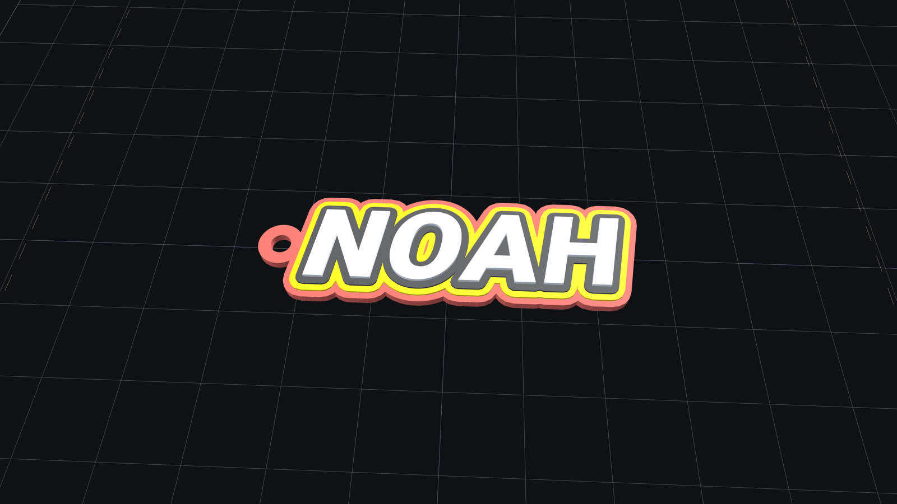
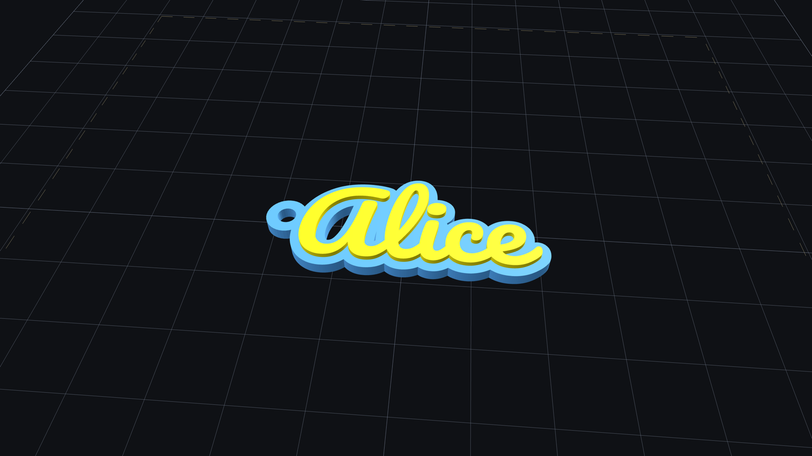
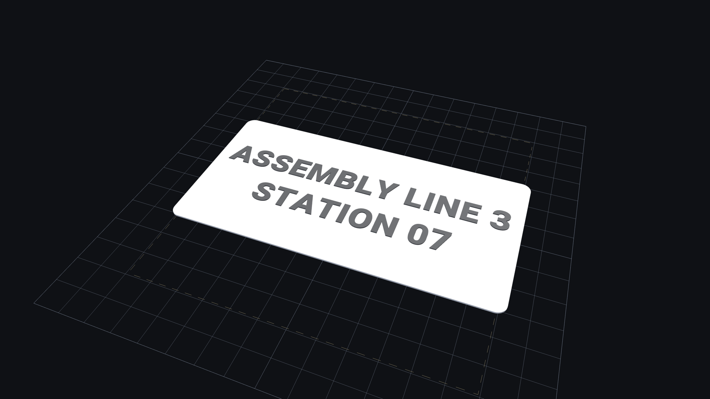
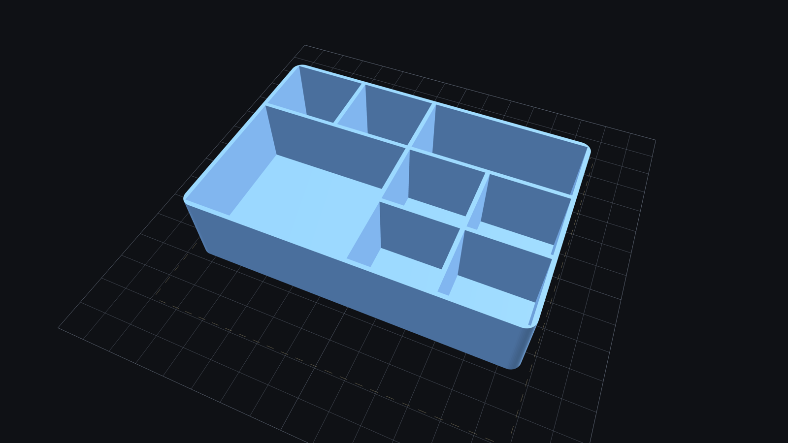

# 名牌 & 收纳盒 参数化生成器

双击 `label-bin-generator.html` → 浏览器打开 → 改参数 → 实时 3D 预览 → **导出 3MF** →
Bambu Studio 双击那个 3MF 即可切片。**全程离线, 不联网, 不装任何东西。**

| 名字挂件 · 乐高风 4 色叠层 | 名字挂件 · 手写体双色 |
|---|---|
|  |  |

| 名牌 · 双色（底板走 1 号槽、文字走 2 号槽） | 收纳盒 · 相邻格可合并成大格 |
|---|---|
|  |  |

<sub>都是网页里 three.js 的实时预览截图。收纳盒图中左侧 2×2 与右后方 1×2 是「合并」出来的大格，中间隔断已消失。</sub>

## 怎么用
1. 双击 `label-bin-generator.html`（Chrome / Edge / Safari 都行）。
2. 顶部切 **名牌** / **收纳盒** / **名字挂件**，左侧改参数，右侧实时出模型（左键转 / 滚轮缩 / 右键平移）。
3. 左下角必须是绿色 **水密 ✓** 才能导出；红色说明网格有问题，按钮会自动禁用。
4. 点 **导出 3MF**，双击下载到的文件，Bambu Studio 会带着双卷 PLA 配置直接打开。

### 名牌
长/宽/板厚/圆角，多行文字，字凸起、字号、行距、字间距、页边距、对齐。
底板走 **1 号槽**、文字走 **2 号槽**，两个部件几何不重叠、字底正好贴在板面上。
字体：内置 3 款西文；**要中文/日文就点「上传 .ttf / .otf」**，字库只在本机解析（不支持 woff2）。
文字超出页边距时默认整体等比缩小，缩放比例会显示在状态栏。

**风格可选**：默认「双色凸字」；选「单色镂空」则字整个挖穿、只用 1 号料。
O / A / B / 8 等字母中间的孤岛会自动加竖向连接桥（桥宽可调，默认 1.2mm），保证一整块不掉件。

### 收纳盒
外框长宽高、壁厚、底厚、圆角、行列数。一体式一次打印、底部封实、整体走 1 号槽。
**大小格混排**：在分格预览图上点选或拖框选中相邻若干格 → 点 **合并所选**，
中间隔断消失合成一个大格；**双击**合并格（或选中后点 **拆开所选**）还原；**全部还原** 清空。
新选区若压到已有合并块，会自动把它吞掉并扩成一个完整矩形。

### 名字挂件（最多 4 色叠层）
输入名字 → 字形向外扩成一圈圈色边，**逐层往上叠、越往上越窄** → 底层并上挂环挖孔，一体式一次打印。
每层单独设 **颜色 / 外扩量 / 厚度**，第 N 层走 N 号料槽（A1 + AMS lite 最多 4 色）。
一键预设：**乐高风 4 色**（红底 → 黄边 → 黑边 → 白字）、3 色、双色、单色。
「倾斜」参数把字做成斜体（乐高那种前倾感约 10°）。
相邻两层外扩量差不足 0.8mm（两道线宽）会警告，色边太细印不出来。
底层断成几块时状态栏显示「连通块 N」，勾 **底部连接条** 或加大底层外扩即可串成一体。
内置 Pacifico 手写连笔体，字母天然相连。

## 尺寸限制（实测）
打印床 256×256（A1）。程序把模型摆在床心 128,128。
- **> 190mm**：黄色警示，仍可导出（这是保守线，贴近幅面边界时请在 Bambu Studio 里确认没压边）。
- **> 250mm**：直接拦截。实测 200×100 ✓ / 240×200 ✓ / 250×250 ✓ 均可切。

## 验收 / 自检
```bash
./verify.sh
```
对 `out/A.3mf out/B.3mf out/C.3mf out/F_keychain.3mf out/G_keychain_lego.3mf` 各跑 `--info`（尺寸 + manifold）和 `--slice 0`
（error: Success + gcode 里的 filament_colour / filament_type），全绿才算过。

## 改代码
源码是 `src/app.html`（不含大 blob），改完重新组装：
```bash
python3 build.py
```
**动几何之前请先读 `PROGRESS.md` 里的「踩过的三个坑」**，尤其是 earcut 会悄悄吞边界边这条。
